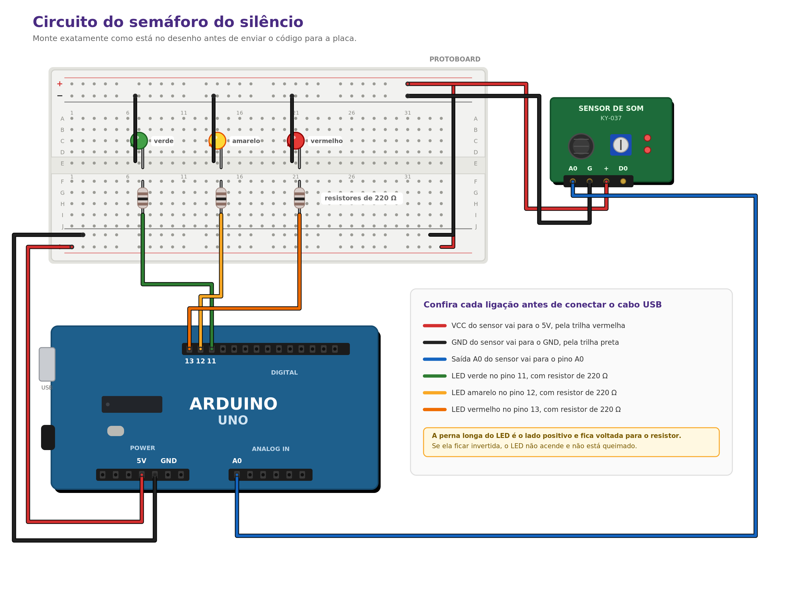

# Semáforo do Silêncio

Projeto STEAM de medição de ruído para o 7º ano do Ensino Fundamental.

Um sensor de som ligado a um Arduino mede o nível de ruído da sala de aula e classifica cada leitura em três faixas, acendendo um LED para cada uma delas. As leituras são enviadas para o Serial Monitor, registradas pela turma e depois transformadas em gráfico. Com esses dados em mãos, os estudantes constroem um Painel de Convivência Sonora e fecham um acordo coletivo sobre o ruído da própria sala.

O centro do projeto não é o circuito. É a turma tomar uma decisão com base em evidência que ela mesma produziu.

## Material pedagógico

O projeto tem dois documentos de apoio, disponíveis à parte:

- Plano de aula do professor, com sequência de cinco encontros e rubrica de avaliação (link)
- Caderno do estudante, com texto de contextualização, roteiro de montagem e questões (link)

## Pergunta investigativa

> Quanto barulho a nossa sala realmente faz, e o que os dados nos dizem sobre como queremos conviver?

## Materiais

| Item | Quantidade | Observação |
|---|---|---|
| Arduino Uno ou compatível | 1 | O Uno R3 é o mais tolerante a erro de ligação |
| Cabo USB tipo A-B | 1 | Alimentação e envio do código |
| Módulo sensor de som KY-037 | 1 | Use a saída analógica |
| LEDs de 5 mm, verde, amarelo e vermelho | 3 | Compõem o semáforo |
| Resistores de 220 Ω | 3 | Um para cada LED |
| Protoboard de 400 pontos | 1 | Dispensa solda |
| Jumpers macho-macho | 15 | Prefira cores diferentes |

## Circuito



| Ligue | No |
|---|---|
| VCC do sensor | 5V do Arduino |
| GND do sensor | GND do Arduino |
| Saída A0 do sensor | Pino A0 do Arduino |
| LED verde | Pino 11, com resistor de 220 Ω |
| LED amarelo | Pino 12, com resistor de 220 Ω |
| LED vermelho | Pino 13, com resistor de 220 Ω |

O pino D0 do módulo não é usado neste projeto. Ele fica livre mesmo.

A perna longa do LED é o lado positivo e fica voltada para o resistor. Se ela ficar invertida, o LED não acende e não está queimado.

## Como usar

1. Abra `semaforo_do_silencio/semaforo_do_silencio.ino` no Arduino IDE
2. Selecione a placa em Ferramentas e depois Placa, escolhendo Arduino Uno
3. Selecione a porta serial correspondente
4. Envie o código para a placa
5. Abra o Serial Monitor em 9600 baud

## Calibração

Os valores `limiteBaixo = 300` e `limiteAlto = 600` que vêm no código são apenas um ponto de partida. Eles estão errados para a sua sala, e estariam errados para qualquer outra, porque cada sensor, cada posição e cada ambiente responde de um jeito diferente.

Use o sketch de calibração que está em `semaforo_do_silencio/calibracao.ino.txt`. Copie o conteúdo para uma pasta chamada `calibracao`, salve como `calibracao.ino` e envie para a placa. Ele mostra a leitura bruta sem acender LED nenhum.

Meça três situações e anote:

| Situação | Leitura observada |
|---|---|
| Sala em silêncio total | |
| Conversa normal | |
| Todo mundo falando ao mesmo tempo | |

Depois volte ao sketch principal e ajuste as duas variáveis.

Vale avisar a turma de que grupos diferentes vão chegar a números diferentes. Isso não é erro, é calibração de instrumento, e a conversa sobre o porquê dessa diferença é uma das partes mais ricas do projeto.

## Estrutura do repositório

```
semaforo-do-silencio/
├── semaforo_do_silencio/
│   ├── semaforo_do_silencio.ino
│   └── calibracao.ino.txt
├── imagens/
│   └── circuito.png
├── docs/
│   └── planilha-de-campo.csv
├── .gitignore
├── LICENSE
└── README.md
```

## Alinhamento curricular

O projeto atende ao complemento de Computação da BNCC e a Ciências:

| Código | Habilidade |
|---|---|
| EF07CO02 | Analisar programas para detectar e remover erros |
| EF07CO03 | Construir soluções computacionais de problemas de diferentes áreas |
| EF07CO08 | Usar as tecnologias de maneira segura, ética e responsável |
| EF69CO01 | Classificar informações agrupando-as em coleções e tipos de dado |
| EF07CI11 | Analisar o uso da tecnologia considerando indicadores ambientais e de qualidade de vida |

Nas áreas do STEAM: som e ondas em Ciências, sensor e programação em Tecnologia, protótipo em Engenharia, painel visual em Arte, e tratamento de série de dados em Matemática.


## Licença

O código está sob licença MIT. O material pedagógico está sob CC BY 4.0, o que permite uso e adaptação desde que a autoria seja mantida.

Criado por Eduardo Domingues.
